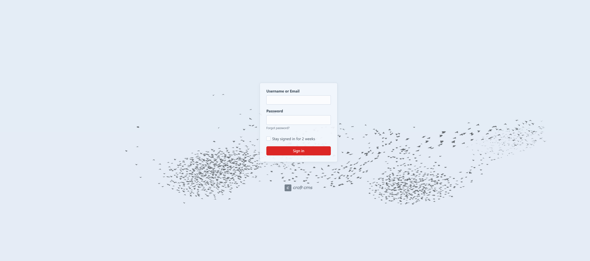

# Murmurations

A Craft CMS plugin to upgrade the boring login screen with an interactive [murmuration](https://en.wikipedia.org/wiki/Starling#Behaviour) of birds 🐦



# Attribution

The bird animation work is from Mr.doobs contributors and can be found here:

https://github.com/mrdoob/three.js/blob/master/examples/webgpu_compute_birds.html

The main contributor is:
https://github.com/cmhhelgeson

Very nice work, Christian Helgeson! 🙌

# Description

This is using Three.js and the new WebGPU API to render a murmuration of birds in the background of the login screen.

Because WebGPU is still in development, this plugin is experimental and may not work well in all browsers.

This should improve soon.

The original work is under a MIT license I believe and this plugin will be free to use.

I have changed the original code to make the birds begin in a more pleasing way.

## Requirements

This plugin requires Craft CMS 5.0.0 or later, and PHP 8.2 or later.

## Installation

Plugin store installation to be added when it gets completed.

#### With Composer

Open your terminal and run the following commands:

First add the repository to your composer.json file:

```json
"repositories": [
    {
        "type": "vcs",
        "url": "https://github.com/MD1618/Murmurations"
    }
]
```

Then run the following commands:

```bash
# go to the project directory
cd /path/to/my-project.test

# tell Composer to load the plugin
composer require martin-drahony/craft-murmurations

# tell Craft to install the plugin
./craft plugin/install murmurations
```

## Report Issues

Please report any issues you find ❤️

[GitHub Issues](https://github.com/MD1618/Murmurations/issues)

## License

This plugin is licensed for free under the MIT License.
